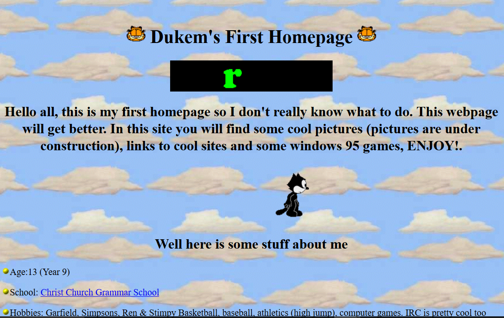
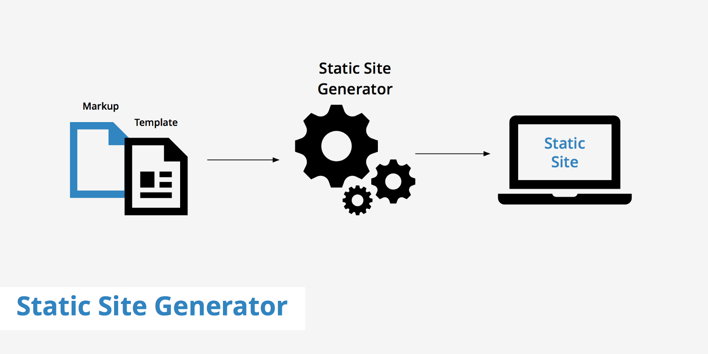

I am a fullstack software developer and feel quite experienced now after 12 years of working with IT projects. I always had the intention to create a personal website, but never could find the time or motivation before. Now that I have decided to try to go freelance I thought it was a good opportunity to finally put down the time to make a personal website/blog. The goal was both to have something fun to work with a learn a bit on the way, and that it hopefully have a bit of professional look to it :)

I have not made a homepage since I was a teenager and created a Geocities website with their online editor. With the awful flashy background, blinking text and of course the mandatory hit counter. A page with practically no content and impossible to find. The bar was not set very high to achieve something more impressive on my second attempt :)

Geocities homepage example

### When looking for the best tool for my use I had a few criteria

* It should use standard web technology
* I want to learn something new
* It should be easy to create content for a technical blog with syntax highligtning
* Should be easy to host, preferably for free
* It should be something that can be easily reused to create a new website for a new project

### What choices are there?

Before doing any research I was aware of a couple options. I could just create plain html files with some css and that would work ok, but the site would probably not be very interactive and impressive. The other clear option would be to use some kind of CMS system(Content Management System). A CMS typically have an online editor where you add your content and need to do some configuration for the menus and navigation. I tried using a .Net CMS system called Orchard before, but I felt I spent most of the time struggling with configuration and trying to achieve things that I could easily do myself with plain html and css. A CMS system must also be hosted at a hosting provider that costs money and time. The far fastest and simplest solution would be to use a Wordpress template and host it on wordpress.com for a few dollars a month. But the goal was to choose something where I could create what I wanted and not be restricted by my choice.

It was time to look for other options and I had recently heard of a free service from Netlify for hosting static websites. A static website is a very simple website with fixed content which will display the same web pages to every visitor. A static site in itself isn't very interesting, but now a new kind of frameworks has emerged, called static site generators.

### So what is a static site generator?

<a href="https://www.keycdn.com/" target="_blank"  rel="noopener noreferrer">Source keycdn</a>

Static site generators seems to bring in some of the best from the CMS world and the best from the single page app world. A static site generator is pretty much what it says, it is a generator that takes the source files of a website and generates an entirely static website. That means that a typical single page app can be built with one of these tools and be hosted as an entirely static files. These generators can create websites for all sorts of purposes, being photo galleries, documentation websites, blog websites etc. 

Static site generators utilize the JAM stack(Javascript, API, Markdown) which pretty much means its a serverless site, built with javascript tools like: Angular, React, Vue etc, and with support for Markdown to create content. Whats best is that there are services now were we can host these websites for free like Netlify, they even pull the source code from github, build and deploy the site for you. No need for time consuming setup for builds of deployments, sounds almost to good to be true.

### What framework to choose

There are many frameworks to choose from, and if you google for "Best static site generator" there is little consensus on the subject. From what I learned is that each javascript framework and programming language have typically its own favored SSG framework. So you are probably best off deciding what technology you want to work with and then find the best ssg framework for that technology. Ie if you are an avid Go programmer you would probably want to choose Hugo. 

I currently enjoy a lot working with node and javascript so I wanted to work with one of the javascript framework based ones. I am most proficient in ReactJs these days so I wanted to work with a ReactJs based framework. For ReactJs there are many to choose from, but I took the safe route and chose the one with the biggest community and largest ecosystem, which is Gatsby. I do not know if it was the best framework for my use but I am happy of my choice after working with Gatsby for a few weeks :) A big benefit of using Gatsby is that because it use ReactJs you get access to a huge community of ReactJs libraries that you can use in your Gatsby website.

### Hosting is simple

Deployment of your website is a breeze if you are combining GitHub, Gatsby and Netlify. It can literally be done in just two minutes. Sign up to Netlify and add a link to your repository in GitHub. Give in the build command "npm run build" and  publish directory "public" and click "Deploy site" and it will be automatically built and deployed on each GitHub commit. Netlify let you define an easy to use alias ie <a href="https://oaeven-blog-netlify.com">oaeven-blog-netlify.com</a> or you can use a custom domain name ie <a href="https://www.oaevensen.com">oaevensen.com</a>. Time to get started!

