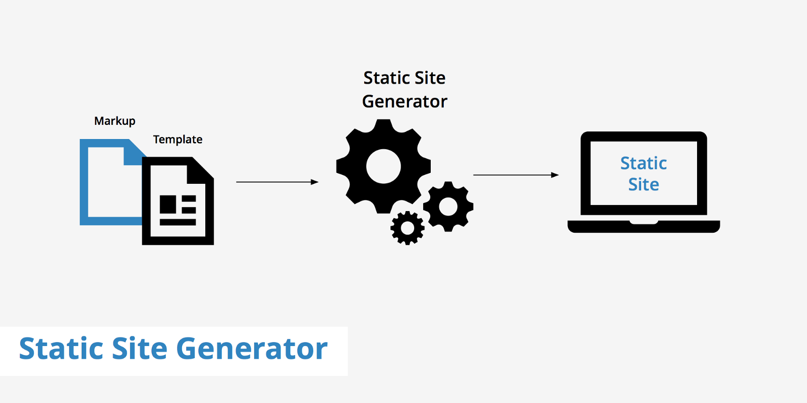

<!-- # Creating a blog site using a static site generator -->

I am a fullstack software developer for 12 years now, and i always had the intention to create a personal website, but never could find the time or motivation. Now that i have decided to try to go freelance i thought it was a good opportunity, to finally put down the time to make a personal webiste/blog that hopefully have a bit of professional look to it :)

I have not made a homepage since i was a teenager and created a Geocities website with their online editor. With the awfull flashy background, blinking text and ofcourse the mandatory hit counter. A page with practically no content and impossible to find. I have briefly ventured into the world of CMS systems when creating a cabin rental information website back in the days and didnt really enjoy that way of working. As a developer i prefer to use the html components and styles i am customed to, and not try to fiddle with nitty gritty details inside an editor.

#### When looking for the best tool for my use i had a few criteria

* It should use standard webtechnology
* I want to learn something new
* It should be easy to create content for a blog with syntax highligtning
* Should be easy to host, preferably for free
* It should be something i could reuse to create a website for a different purpose 

## Options

I have to admit that my research was not very extensive. I did not really want to go the CMS route after previous experiences with EpiServer and Orchard, that were both a bit hassle to work with. It would definetely be easiest and faststet to just signup for a personal Wordpress site with hosting, but that means a monthly fee albeit low and the restrictions Wordpress impose.

Another simple option would be to just make plain html files with some simple css and put it on one of those free webhosts you get with a domain. But that would lead to a pretty boring website and would not really showcase any of my developer skillset(im sure there are geniouses out there that can make amazing sites with just plain html, js and css). From my work im used to work with single page apps in javascript with Angular/React and not afraid to "program" the content of a website. But the issue with both a CMS and a single page app is that they both are dynamic webpages and require a running backend host to serve the pages. 

## What is a static site generator

<a href="https://www.keycdn.com/" target="_blank"  rel="noopener noreferrer">Source keycdn</a>

I then started looking at an option that has grown in popularity and seems to be the next "new thing" for websites, something called static site generators. It seems to bring in some of the best from the CMS work and the best from the single page app world. A static site generator is pretty much what it says, it is a generator that takes the source files of a website and generates an entirely static website. That means that a typical single page app can be built with one of these tools and be hosted as entirely static files. These generators can create websites for all sorts of purposes, being photo galleries, documentation websites, blog websites etc. They utilize the JAM stack(Javascript, API, Markdown) which pretty much means its a serverless site built with javascript tools like Angular, React, Vue etc and with support for Markdown to create content. Whats best is that there are services now were we can host these websites for free like Netlify, they even pull the source code from github and deploy the site for you. No need for builds and deployments, sounds almost to good to be true.

## choose framework

What tool to use, there are a dusin of these

How to get started, everything looks very familiar but also very different

